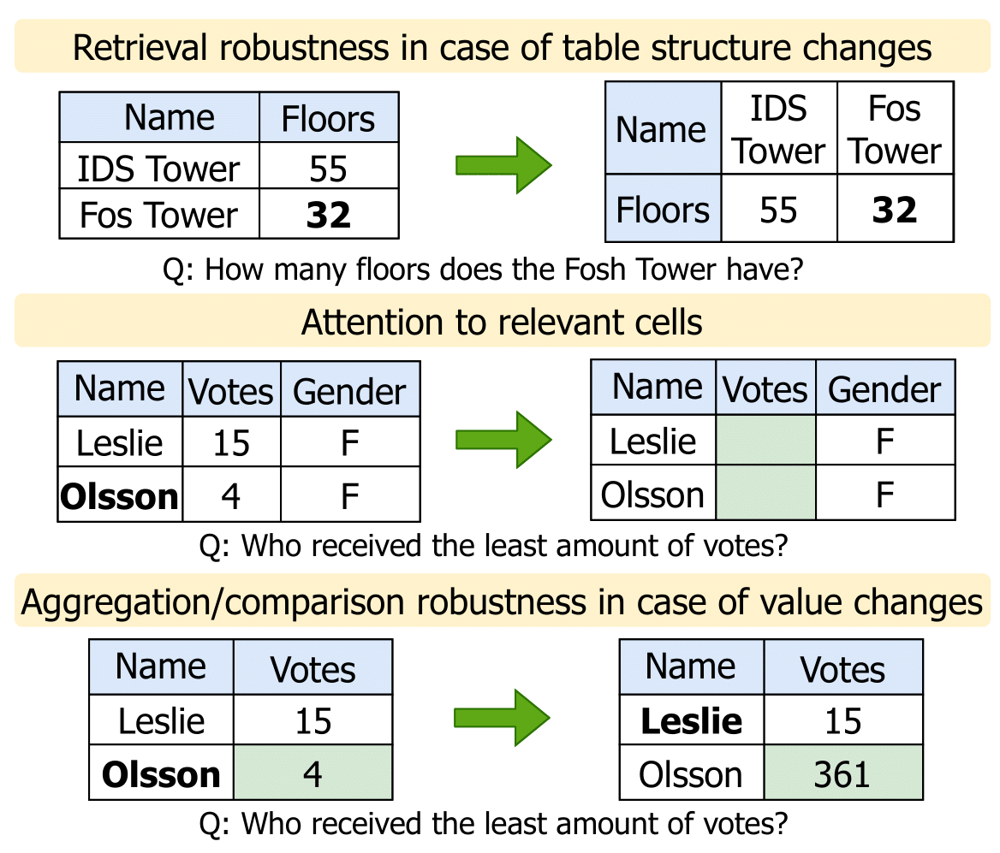

# [NAACL 2024] FREB-TQA: A Fine-Grained Robustness Evaluation Benchmark for Table Question Answering

This repo holds the code and datasets for [FREB-TQA: A Fine-Grained Robustness Evaluation Benchmark for Table Question Answering](https://aclanthology.org/2024.naacl-long.137/) by Wei Zhou, Mohsen Mesgar, Heike Adel and Annemarie Friedrich.



## 1. Set up

```
git clone https://github.com/boschresearch/FREB-TQA.git && cd FREB-TQA
pip install -r requirements.txt
```

Download the `evaluator.py` from https://github.com/ppasupat/WikiTableQuestions/blob/master/evaluator.py and put it into the `code` folder. Since this file is written in Python 2 but not 3, we need to make some adapations. More specifically:

1. Comment out codes from line 346 to line 395 (`def main()`)
2. Replace all occurrences of `ur` to `r` in the `re.sub` function.
3. Replace `basestring` to `str` in line 112 and delete `long` in line 134.
4. Comment out line 58-62.

The repo contains the following folders:

`dataset`: the source of the evaluation datasets. It contains three parts, corresponding to the three robustness aspects proposed.

`code`: code for the perturbation functions, generating answers for different perturbations and evaluation.

`scripts`: scripts for creating perturbations according to the perturbation functions and generating answers for perturbations.

## 2. Generating answers for different perturbations

The current scripts support generating answers directly for **TaPas**, **Tapex**, **OmniTab** and **Qwen** models.

To do so, simply running the scripts in the `scripts` folder.

The scripts will create a folder `results` containing three subfolders, each correspond to one aspect (1-->structure robustness, 2-->attention to relevant cells, 3-->aggregation/comparison robustness).

For other models or to modify inputs (e.g., add demonstrations), one could generate all perturbations by running `code/merge.py`. This will create three different files, containing instances for all perturbation functions and datasets in terms of each robustness aspect.

After that, simply run your models on the perturbations. The output result file should be in a json file, with each line a dictionary,
`{"id": question_id, "pred_answer": some_value, "seed": seed_value, "dataset": dataset_info, "perturb": perturbation_method}`

The above values must be included in the dictionary.

## 3. Evaluation

If you generate answers by running the provided scripts, simply run the following command:
`python evaluation.py --model_path path_to_the_model_generating_answers  --seed  perturbation_seed  --part  robustness_aspect_to_evaluate `

If you merge all perturbations, run:
`python evaluation.py --model_path path_to_the_model_generating_answers  --seed  perturbation_seed  --part  robustness_aspect_to_evaluate  --merge  --merge_path  path_to_the_merged_file `
The evaluation scripts will create a json file for each aspect+dataset+seed+model, e.g., `{system}_{dataset}_{seed}_{aspect}.json`

## License

The dataset is licensed under CC-BY-SA-4.0.

The code is licensed under ACPL-3.0

## Cite

```
@inproceedings{zhou-etal-2024-freb,
    title = "{FREB}-{TQA}: A Fine-Grained Robustness Evaluation Benchmark for Table Question Answering",
    author = "Zhou, Wei  and
      Mesgar, Mohsen  and
      Adel, Heike  and
      Friedrich, Annemarie",
    editor = "Duh, Kevin  and
      Gomez, Helena  and
      Bethard, Steven",
    booktitle = "Proceedings of the 2024 Conference of the North American Chapter of the Association for Computational Linguistics: Human Language Technologies (Volume 1: Long Papers)",
    month = jun,
    year = "2024",
    address = "Mexico City, Mexico",
    publisher = "Association for Computational Linguistics",
    url = "https://aclanthology.org/2024.naacl-long.137",
    doi = "10.18653/v1/2024.naacl-long.137",
    pages = "2479--2497",
    abstract = "Table Question Answering (TQA) aims at composing an answer to a question based on tabular data. While prior research has shown that TQA models lack robustness, understanding the underlying cause and nature of this issue remains predominantly unclear, posing a significant obstacle to the development of robust TQA systems. In this paper, we formalize three major desiderata for a fine-grained evaluation of robustness of TQA systems. They should (i) answer questions regardless of alterations in table structure, (ii) base their responses on the content of relevant cells rather than on biases, and (iii) demonstrate robust numerical reasoning capabilities. To investigate these aspects, we create and publish a novel TQA evaluation benchmark in English. Our extensive experimental analysis reveals that none of the examined state-of-the-art TQA systems consistently excels in these three aspects. Our benchmark is a crucial instrument for monitoring the behavior of TQA systems and paves the way for the development of robust TQA systems. We release our benchmark publicly.",
}
```
